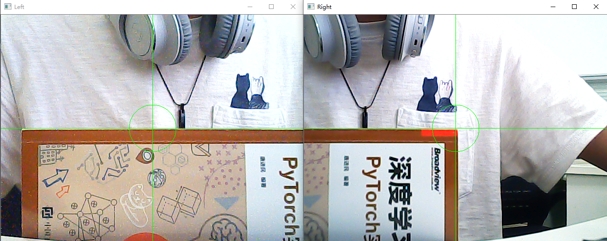
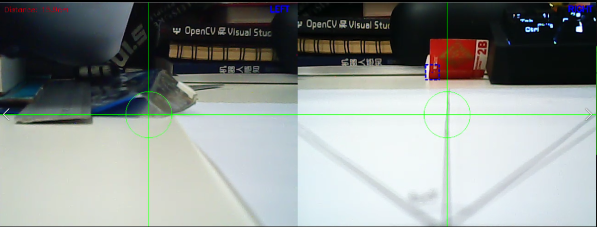
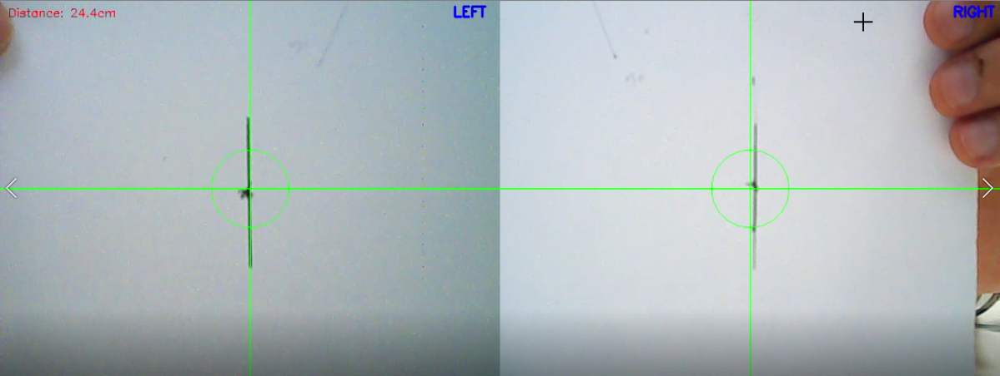
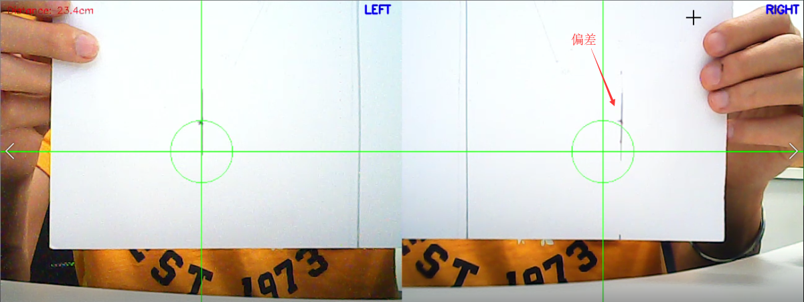
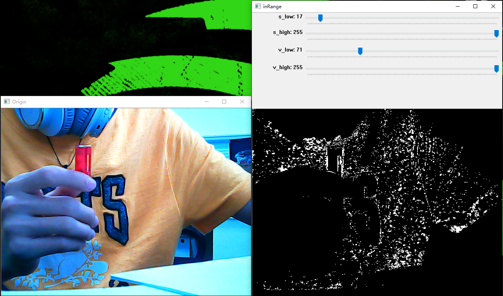
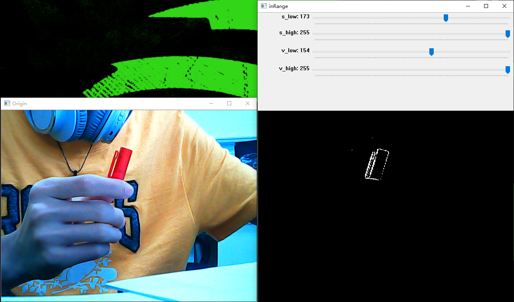
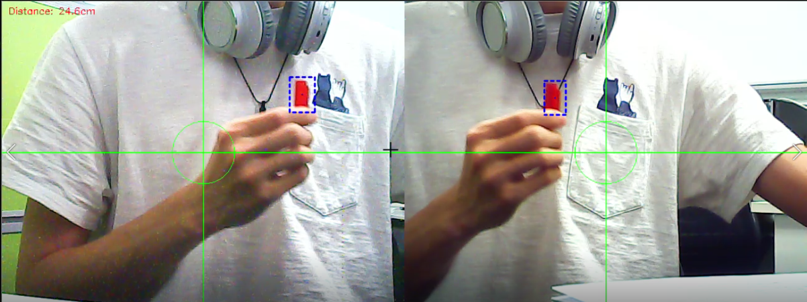
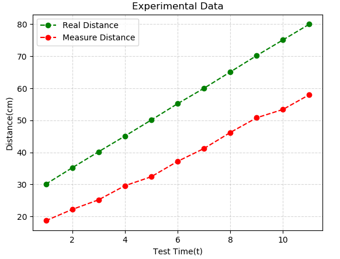
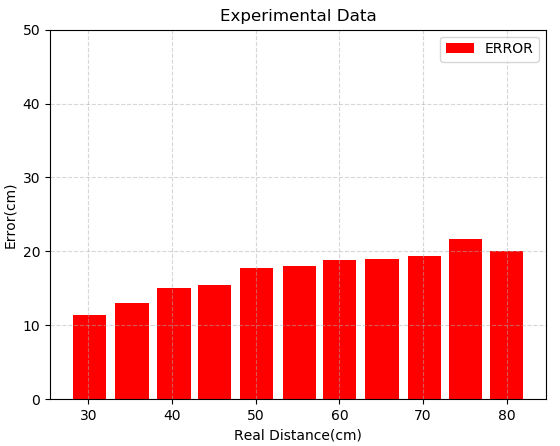
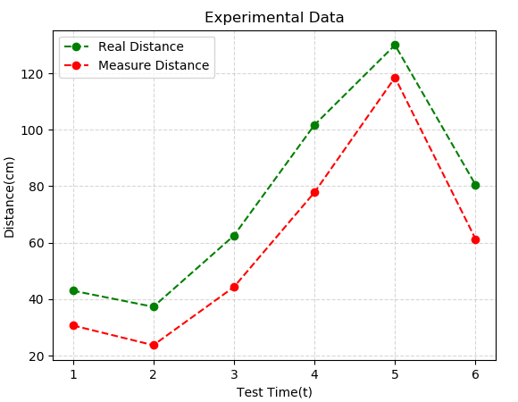

## Stereo-System

### 1. Introduction

在演示视频中，系统追踪红色笔盖，通过红色笔盖在左右两个不同frame中的坐标计算视差，从而计算出间隔距离。从视频中可以看到，当笔盖靠近摄像头时，距离变小；笔盖远离摄像头时，距离变大。整个过程中距离变化很平滑，很少有距离突变的情况（偶尔突变是因为追踪算法中计算笔盖中心部分有偏差，与测距算法无关）。实验过程中，距离以mm精度变化（此处精度指的是距离变化单位分度，并非精确度）。

<div align=center></div>

### 2. Usage

* clone 项目

```bash
git clone https://github.com/HarderThenHarder/StereoSystem.git
```
* 运行目标追踪参数调试工具，记录下想要追踪目标的HSV上下限

```bash
python seeORV.py
```

* 运行双目测距文件，注意需要设置文件中的HSV上下限为步骤2中记录的上下限

```bash
python cameraMeasure.py
```

### 3. Experiment

1. 矫正摄像头使其达到水平。放置一个水平物体，使得左右frame的参考线都与该水平物体对齐。

<div align=center></div>

2. 测量摄像头内部参数，主要测量参数有：间距、水平视角。首先测量相机的水平视角，使用一张A4纸，中间画上垂线，使相机垂直参考线对其中垂线，标定左右最大视角点，用量角器测量其角度即可得到水平视角。

<div align=center></div>
分别对左右摄像头进行测量，经测量，摄像头水平视角为50°。

3. 测试摄像机有无cross-eye现象，如果是标准矫正的摄像头，在近处测量16.5cm的线条，在远处也应该和左右垂直参考线重合，做实验测试：

<div align=center></div>
<div align=center></div>

可见这一步并没有做到完全矫正，右端线条没有完全重合，原因是使用透明胶带将两个摄像头绑在钢条上，这种固定方式太简陋，所以无法起到完全稳定的作用。这一步也是导致后面实验误差的重要原因。

4. 在该测试场景中，要让测试系统去Trace一个笔盖，因此需要调整阈值来使得识别器能够在场景中Trace指定物体：

<div align=center></div>
<div align=center></div>

调整阈值后，环境中的不相关噪点信号都被滤掉，所检测物体的轮廓能够清晰可见。保留这一阈值，将其应用到测距系统中，使其测距系统能够很好的进行目标追踪。

5. 一切准备工作完成，启动双目测距系统进行距离识别：

<div align=center></div>

### 4. Result

选取30cm–80cm的范围，5cm的实验间隔进行数据测试，同时测量真实物理距离和测距系统计算出的距离值，记录数据并绘制折线图如下图所示：

<div align=center></div>

横轴代表实验次数，纵轴代表距离深度。绿色折线代表物理真实距离，红色折线代表测距系统给出的测量距离。可见真实距离和测量距离存在较为稳定的误差（即对于每个测量点，物理距离和测量距离的差值近似为一个定值（15cm左右）），这是因为实验所用设备和固定装置过于过于简陋造成的，可通过提升硬件质量来减小这种误差，和测距算法无关。对每个测量点的误差进行可视化，结果如下图所示：

<div align=center></div>

通过上图可知测量误差范围在10-20cm之间波动，且随着距离增加而增加。提升硬件质量、细化摄像头矫正步骤、稳定固定装置均可减小实验结果误差。因为测距误差可以通过计算得到并且存放到矫正系数中，因此该方法实际的测距误差只有5-10cm。<br><br>

重复试验，这次不按照距离递增取点，而是在30-150cm内随机选取6个位点进行试验测距，得到的真实距离和测试距离折线图如下所示：

<div align=center></div>

测量折线变化趋势和真实折线变化趋势相同，且上下两个折线的间距维持在一个范围以内，说明测距系统能够较好的工作。
